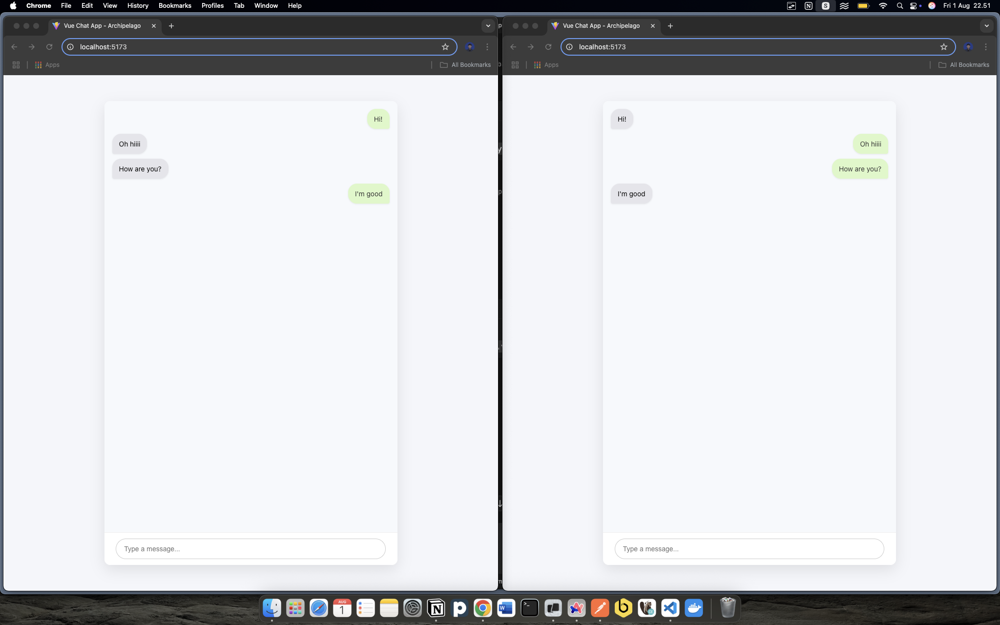

## Basic Question

### High Level Requirements
- Users can upload photos
- Photos are stored in S3
- Each photo starts as `UNDER_REVIEW`
- Moderator can approve (photo goes public) or reject (photo is deleted and URL cleared)

### Entities
Photo
- id -> UUID / INT
- user_id -> UUID / INT
- s3_url -> TEXT
- status -> ENUM<UNDER_REVIEW | APPROVED | REJECTED>
submitted_at -> TIMESTAMP
reviewed_at -> TIMESTAMP

### Workflow and System Design
1. Photo Upload (User)
- User uploads an image via frontend
- Image is sent to backend or directly to S3
- After successful upload:
  - If the image uploaded through backend, then BE will save the s3_url and `UNDER_REVIEW` status
  - If the image uploaded directly to S3 from frontend, then call the backend to save the s3_url and `UNDER_REVIEW` status in the database

2. Moderation (Moderator)
- Moderator will have a dashboard to review pending photos with status `UNDER_REVIEW`
- For each photo, moderator can choose:
  - Approve
  - Reject

3. Actions
    
    A. Approve
    - Set status to `APPROVED`
    - Set reviewed_at to now()

    B. Reject
    - Delete image from S3
    - Set status to `REJECTED`
    - Set s3_url to NULL
    - Set reviewed_at to now()

### Edge Cases
1. To prevent stale photos (user uploads but moderator never reviews), createn a cron to delete stale photos after some period of time
2. When moderator tries to reject a missing file, gracefully handle 404 from S3 and still mark as `REJECTED` without throwing error

## Database Questions

### Level 1
```sql
SELECT COUNT(*) as Total
FROM Customers
WHERE Country = 'Germany';
```

### Level 2
```sql
SELECT
    COUNT(CustomerId) as Total,
    Country
FROM Customers
GROUP BY Country
HAVING COUNT(CustomerId) >= 5
ORDER BY COUNT(CustomerId) DESC;
```

### Level 3
```sql
SELECT
    c.CustomerName,
    COUNT(o.OrderDate) AS OrderCount,
    MIN(o.OrderDate) AS FirstOrder,
    MAX(o.OrderDate) AS LastOrder
FROM Customers c
LEFT JOIN Orders o
    ON c.CustomerId = o.CustomerId
GROUP BY c.CustomerName
HAVING COUNT(o.OrderDate) >= 5
ORDER BY MAX(o.OrderDate) DESC;
```


## JavaScript/TypeScript Questions

### Level 1
```jsx
const titleCase = (strInput) => {
  return strInput
    .toLowerCase()
    .split(" ")
    .map((word) => word.charAt(0).toUpperCase() + word.slice(1))
    .join(" ");
};

console.log(titleCase("I'm a little tea pot")); // "I'm A Little Tea Pot"
console.log(titleCase("sHoRt AnD sToUt")); // "Short And Stout"
console.log(titleCase("SHORT AND STOUT")); // "Short And Stout"
```

### Level 2
```js
function delay(ms) {
  return new Promise((resolve) => setTimeout(resolve, ms));
}

delay(3000).then(() => console.log("runs after 3 seconds"));

// IN BROWSER WITH ALERT
// delay(3000).then(() => alert("runs after 3 seconds"));
```

### Level 2.5
```js
function fetchData(url) {
  return new Promise((resolve, reject) => {
    setTimeout(() => {
      if (!url) {
        reject("URL is required");
      } else {
        resolve(`Data from ${url}`);
      }
    }, 1000);
  });
}

function processData(data) {
  return new Promise((resolve, reject) => {
    setTimeout(() => {
      if (!data) {
        reject("Data is required");
      } else {
        resolve(data.toUpperCase());
      }
    }, 1000);
  });
}

const main = async (url) => {
  try {
    const data = await fetchData(url);
    const processedData = await processData(data);
    console.log("Processed Data:", processedData);
  } catch (err) {
    console.error("Error:", err);
  }
};

main("https://example.com");
```

### Level 3 and 4
Apologies, I wasn't able to deploy the chat app to AWS as my subscription is inactive.

You can run the chat app locally by cloning the repository, navigating to the `chat-app` directory, and following the instructions in the separate `README.md` file. 



## Vue.js
1. Explain Vue.js reactivity and common issues when tracking changes.

    Reactivity is a programming paradigm that allows us to adjust to changes in a declarative manner. In Vue, component state consists of reactive JavaScript objects. When you modify them, the view updates.

    Since Vue's reactivity tracking works over property access, we must always keep the same reference to the reactive object. This means *we can't easily replace a reactive object* because the reactivity connection to the first reference is lost.

    Source: https://vuejs.org/guide/extras/reactivity-in-depth


2. Describe data flow between components in a Vue.js app

    All props form a one-way-down binding between the child property and the parent one: when the parent property updates, it will flow down to the child, but not the other way around.

    - Parent passes data to child via props
    - Child sends events to parent with $emit

    Source: https://vuejs.org/guide/components/props.html#one-way-data-flow


3. List the most common cause of memory leaks in Vue.js apps and how they can be solved.

    - Forgetting to remove event listeners or timers
    - Not cleaning up WebSocket or subscriptions


4. What have you used for state management

    I last used Vue in 2020, and at that time I used Vuex


5. What's the difference between pre-rendering and server side rendering?

    - Pre-rendering: generates static HTML at build time, fast but static
    - SSR: generates HTML on each request, dynamic but slower


## Website Security Best Practices
1. Use HTTPS
2. Validate and sanitize the input to prevent XSS and SQL Injection
3. Implement proper authentication and authorization
4. Rate limiting and throttling to prevent DoS or brute force
5. Don't expose the secrets in code, use env var instead


## Website Performance Best Practices
1. Lazy loading
2. Caching
3. Compress assets and minify the codes
4. Use CDN
5. Use server-side rendering if possible
6. Avoid render-blocking resources


## Golang
```go
package main

import (
	"fmt"
	"strings"
)

func countWords(input string) map[string]int {
	input = strings.ToLower(input) // to lowercase
	words := strings.Fields(input) // split the words
	counts := make(map[string]int)

	for _, word := range words {
		cleanedWord := strings.Trim(word, ".,!?;:\"'") // trim common punctuation
		counts[cleanedWord]++
	}

	return counts
}

func main() {
	input := "Four, One two two three Three three four  four   four"
	result := countWords(input)

	for word, count := range result {
		fmt.Printf("%s => %d\n", word, count)
	}
}
```


## Tools
- Git -> 5
- Redis -> 5
- VSCode -> 5
- Linux -> 5
- AWS
  - EC2 -> 5
  - Lambda -> 5
  - RDS -> 5
  - CloudWatch -> 5
  - S3 -> 5
- Unit Testing -> 5
- Kanban Board -> 5
